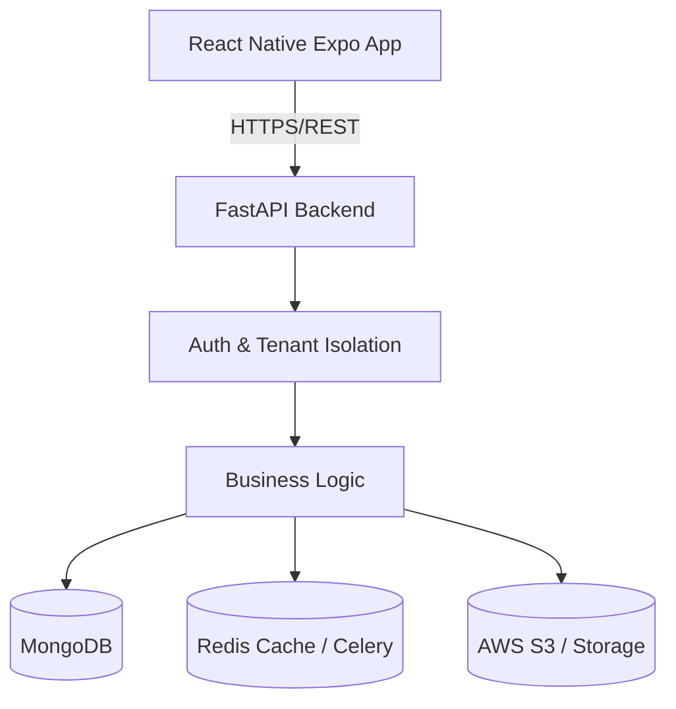

# MessMate Architecture

MessMate is a multi-tenant SaaS application designed to manage hostel dining, student meal preferences, and food waste reduction.

## High-Level System Architecture

## Multi-Tenant Design
Every institution is isolated at the application level. 
The key `institution_or_hostel_name` acts as the Tenant ID across all documents (Users, Menus, Subscriptions, Logs).

The `require_tenant_access` dependency explicitly denies cross-tenant queries. Global roles (`SUPER_ADMIN`) bypass this lock.

## Key Collections
- `users`: Core identity table (Admins, Students).
- `menus`: Daily meal structures (Breakfast, Lunch, Dinner).
- `daily_plans`: Student opt-in/opt-out statuses for waste calculation.
- `subscriptions`: Institution billing plans and trial states.
- `transactions`: Payment history.
